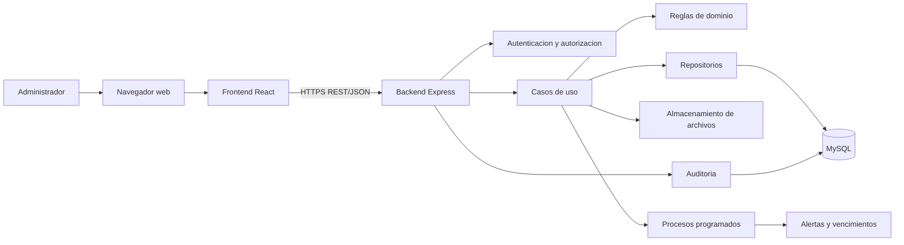
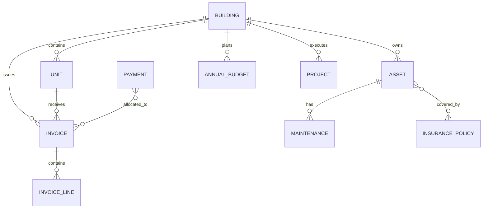

# Arquitectura del sistema de gestión administrativa

## 1. Propósito y alcance

Este documento define la arquitectura técnica y las reglas de organización del sistema de gestión administrativa de edificios. Su objetivo es servir como guía para el desarrollo, revisión y evolución del producto.

La solución será un **monolito modular**: una única aplicación desplegable que contiene el frontend y el backend, pero con módulos de negocio aislados mediante límites claros. Esta decisión conserva la simplicidad operativa de un monolito y permite separar responsabilidades para una futura evolución.

Los módulos funcionales son:

- Administración y acceso: edificios, unidades, usuarios, roles, permisos y auditoría.
- Activos: inventario, clasificación, costos, proveedores y trazabilidad.
- Mantenimientos: programación, intervenciones, costos, proveedores y alertas.
- Seguros: pólizas, coberturas, vencimientos, cotizaciones y reclamaciones.
- Facturación y recaudo: facturas, pagos, aplicación de pagos, cartera, recibos e intereses.
- Presupuesto: presupuestos anuales, categorías y ejecución.
- Proyectos: planificación, cotizaciones, avances, costos y cierre.

## 2. Decisiones arquitectónicas

| Decisión          | Elección                                  | Justificación                                                                                                                               |
| ----------------- | ----------------------------------------- | ------------------------------------------------------------------------------------------------------------------------------------------- |
| Estilo            | Monolito modular                          | Reduce complejidad de despliegue y mantiene límites de dominio explícitos.                                                                  |
| Frontend          | React.js                                  | Interfaz web dinámica para el administrador.                                                                                                |
| Backend           | Node.js + Express                         | API REST sencilla de integrar con React.js.                                                                                                 |
| Persistencia      | MySQL                                     | Base relacional, transaccional y apropiada para datos financieros.                                                                          |
| Acceso a datos    | ORM + SQL parametrizado (`mysql2`)        | El ORM cubre CRUD y relaciones simples; el SQL explícito cubre finanzas, reportes, agregaciones y bloqueos. El driver de MySQL es `mysql2`. |
| Contrato          | REST/JSON                                 | Contrato simple y ampliamente interoperable.                                                                                                |
| Validación        | Zod en los límites de entrada             | Evita que datos inválidos entren al dominio.                                                                                                |
| Autenticación     | Sesión basada en cookie HttpOnly          | Evita exponer credenciales de sesión al JavaScript del navegador.                                                                           |
| Documentación API | OpenAPI                                   | Hace el contrato consultable y facilita pruebas e integración.                                                                              |
| Archivos          | Almacenamiento externo o volumen dedicado | La base de datos conserva metadatos; no se almacenan binarios grandes en tablas.                                                            |

La aplicación debe respetar este stack base. Las librerías auxiliares pueden incorporarse únicamente cuando resuelvan una necesidad concreta y queden documentadas.

## 3. Vista general de la solución



### Flujo de una solicitud

1. React envía una solicitud HTTP al endpoint REST.
2. El middleware de seguridad identifica al usuario y el edificio autorizado.
3. El controlador valida la forma de la entrada y delega al caso de uso.
4. El caso de uso aplica las reglas de negocio y coordina repositorios.
5. El repositorio persiste o consulta mediante ORM o SQL parametrizado, dentro de una transacción cuando corresponda.
6. El backend registra la operación auditable y devuelve una respuesta con formato consistente.
7. React actualiza la pantalla y presenta el resultado o los errores de validación.

Los controladores no contienen reglas de negocio. El dominio no conoce Express, el ORM, `mysql2` ni React.js.

## 4. Estructura del repositorio

```text
proyecto-2/
├── apps/
│   ├── api/
│   │   ├── src/
│   │   │   ├── config/              # Variables de entorno y configuración
│   │   │   ├── shared/              # Errores, respuesta HTTP, logger y utilidades
│   │   │   ├── infrastructure/      # MySQL, archivos y tareas programadas
│   │   │   ├── modules/
│   │   │   │   ├── administration/
│   │   │   │   ├── assets/
│   │   │   │   ├── maintenance/
│   │   │   │   ├── insurance/
│   │   │   │   ├── billing/
│   │   │   │   ├── budget/
│   │   │   │   └── projects/
│   │   │   └── app.ts               # Composición de Express
│   │   ├── database/
│   │   │   ├── migrations/
│   │   │   ├── seeds/
│   │   │   ├── models/              # Esquema o modelos del ORM
│   │   │   └── connection.js        # Pool mysql2 compartido con el ORM
│   │   └── tests/
│   └── web/
│       ├── src/
│       │   ├── app/                  # Router, providers y configuración
│       │   ├── components/           # Componentes reutilizables de UI
│       │   ├── features/             # Pantallas y lógica por módulo
│       │   ├── services/             # Cliente HTTP y servicios transversales
│       │   ├── hooks/
│       │   ├── types/
│       │   └── main.jsx
│       └── tests/
├── packages/
│   └── contracts/                    # Contratos JSON compartidos, si aplica
├── docs/
│   └── ARCHITECTURE.md
├── .env.example
├── docker-compose.yml
├── package.json
└── README.md
```

La implementación puede iniciar en una sola carpeta si el equipo lo prefiere, pero debe conservar la separación conceptual entre `apps/api` y `apps/web`.

## 5. Arquitectura interna del backend

Cada módulo de negocio sigue cuatro capas:

```text
modules/assets/
├── domain/
│   ├── entities/             # Entidades y estados válidos
│   ├── value-objects/        # Valores con invariantes propias
│   └── errors/               # Errores del dominio
├── application/
│   ├── use-cases/            # Registrar, consultar, actualizar, etc.
│   └── dto/                  # Datos de entrada y salida del caso de uso
├── infrastructure/
│   ├── persistence/          # Repositorios: ORM para CRUD, SQL para consultas exigentes
│   └── services/             # Integraciones externas del módulo
└── presentation/
    ├── http/                 # Controladores, rutas y esquemas Zod
    └── serializers/          # Conversión a respuestas públicas
```

### Reglas de dependencia

- `presentation` puede depender de `application`.
- `application` puede depender de `domain` y de interfaces de repositorio.
- `infrastructure` implementa las interfaces definidas por `application` o `domain`.
- `domain` no depende de ninguna librería de infraestructura. Tampoco conoce el ORM ni el SQL.
- Un módulo no consulta directamente las tablas internas de otro módulo; utiliza casos de uso o contratos definidos.
- Las operaciones que modifican varias entidades financieras deben ejecutarse dentro de una transacción.
- Los repositorios son el único lugar que elige entre ORM y SQL. Los casos de uso piden intenciones (`aplicarPago`, `listarActivosPorEdificio`), no consultas.

### Estrategia de acceso a datos

El sistema usa **ambos** enfoques de forma deliberada. No es opcional mezclarlos al azar: cada repositorio elige el mecanismo según el tipo de operación.

| Enfoque           | Uso                                                                                                                                                                      |
| ----------------- | ------------------------------------------------------------------------------------------------------------------------------------------------------------------------ |
| ORM               | Altas, lecturas, actualizaciones, borrado lógico y relaciones simples de catálogo: edificios, unidades, activos, proveedores, pólizas, usuarios, roles, adjuntos, hitos. |
| SQL parametrizado | Facturación y recaudo, aplicación de pagos, saldos, reversiones, intereses, ejecución presupuestal, reportes, vencimientos de jobs y cualquier `SELECT ... FOR UPDATE`.  |

Reglas:

- El ORM se apoya en el pool de `mysql2`. El SQL crudo se ejecuta con el API de consultas nativas del ORM o con `mysql2`, **siempre parametrizado**.
- Una operación de negocio que abre transacción debe completar ORM y SQL dentro de **la misma** transacción.
- Está prohibido concatenar valores de usuario en SQL. Está prohibido hidratar colecciones grandes en memoria para calcular totales que MySQL puede agregar.
- El ORM no sustituye migraciones: el esquema se versiona en `database/migrations`.
- No se usa sincronización automática de esquema (`sync`, `push` no controlado) en ambientes compartidos o producción.
- Un listado paginado no carga relaciones completas por defecto, ni con ORM ni con `JOIN` innecesarios.

## 6. Responsabilidad de cada módulo

### Administración y acceso

Gestiona edificios, unidades, responsables, usuarios, roles, permisos, sesiones y auditoría. Define el contexto de seguridad: un usuario solo puede consultar o modificar los edificios asignados.

Entidades principales: `Building`, `Unit`, `Person`, `User`, `Role`, `Permission`, `UserBuilding`, `AuditLog`.

### Activos

Gestiona el inventario y su ciclo de vida. Un activo pertenece a un edificio y puede relacionarse con proveedores, mantenimientos y pólizas.

Entidades principales: `Asset`, `AssetType`, `AssetStatusHistory`, `AssetCost`, `Supplier`.

### Mantenimientos

Registra mantenimientos preventivos y correctivos, costos estimados y reales, proveedores, cotizaciones, evidencias y alertas.

Entidades principales: `Maintenance`, `MaintenanceSchedule`, `MaintenanceStatusHistory`, `MaintenanceQuote`, `MaintenanceAttachment`.

### Seguros

Gestiona pólizas, coberturas, vigencias, activos cubiertos, cotizaciones y reclamaciones. Las fechas deben validarse en el dominio y los vencimientos deben poder consultarse por rango.

Entidades principales: `InsurancePolicy`, `PolicyCoverage`, `PolicyAsset`, `InsuranceQuote`, `Claim`.

### Facturación y recaudo

Gestiona la generación de conceptos y facturas, pagos, aplicación de pagos, saldos a favor, recibos e intereses de mora. Es el módulo con mayor exigencia transaccional y el que más debe apoyarse en SQL explícito.

Entidades principales: `BillingPeriod`, `Charge`, `Invoice`, `InvoiceLine`, `Payment`, `PaymentAllocation`, `CashReceipt`, `LateInterest`.

Reglas esenciales:

- Una factura conserva el detalle de sus conceptos y su total histórico.
- Un pago puede aplicarse a varias facturas y una factura puede recibir varios pagos.
- El saldo se calcula a partir de los movimientos registrados, no mediante sobrescritura sin historial.
- Las reversiones generan movimientos compensatorios y no eliminan evidencia.
- Los intereses se calculan sobre capital vencido, sin capitalizar intereses previos.

### Presupuesto

Gestiona presupuestos anuales, categorías, versiones y ejecución. Debe distinguir valores presupuestados, comprometidos, ejecutados y disponibles. Las consultas de ejecución y disponibilidad se resuelven con SQL agregado, no recalculando el presupuesto en memoria.

Entidades principales: `AnnualBudget`, `BudgetLine`, `BudgetExecution`.

### Proyectos

Gestiona proyectos aprobados, cotizaciones, hitos, avances, costos y cierre. Un proyecto puede relacionarse con partidas presupuestales y documentos.

Entidades principales: `Project`, `ProjectQuote`, `ProjectMilestone`, `ProjectProgress`, `ProjectCost`.

## 7. Modelo de datos y consistencia

- Todas las tablas deben tener identificador interno, fecha de creación y fecha de actualización.
- Las entidades relevantes deben conservar `createdBy` y `updatedBy`.
- Las relaciones deben protegerse con claves foráneas e índices.
- Los montos se almacenan como `DECIMAL`, nunca como `FLOAT`.
- Las fechas se almacenan en UTC y se presentan en la zona horaria configurada del edificio.
- Los estados se modelan como valores controlados y sus cambios importantes se registran en tablas de historial.
- Las eliminaciones de registros operativos deben ser lógicas cuando exista trazabilidad financiera o administrativa.
- Las migraciones son obligatorias: no se modifica la base de datos manualmente en ambientes compartidos.
- El ORM mapea tablas y relaciones; no es la fuente de verdad del esquema. La fuente de verdad son las migraciones SQL.

Relaciones de alto nivel:



## 8. API REST

Prefijo: `/api/v1`.

Ejemplos de recursos:

| Recurso                           | Operaciones principales                       |
| --------------------------------- | --------------------------------------------- |
| `/auth`                           | iniciar sesión, cerrar sesión, usuario actual |
| `/buildings`                      | listar, consultar y actualizar edificios      |
| `/buildings/:buildingId/assets`   | crear, listar y actualizar activos            |
| `/assets/:assetId/maintenance`    | registrar y consultar mantenimientos          |
| `/buildings/:buildingId/policies` | gestionar pólizas y vencimientos              |
| `/buildings/:buildingId/invoices` | generar y consultar facturas                  |
| `/buildings/:buildingId/payments` | registrar y aplicar pagos                     |
| `/buildings/:buildingId/budget`   | administrar presupuesto y ejecución           |
| `/buildings/:buildingId/projects` | administrar proyectos y avances               |
| `/audit-logs`                     | consultar auditoría autorizada                |

Formato de éxito:

```json
{
  "data": {},
  "meta": { "requestId": "..." }
}
```

Formato de error:

```json
{
  "error": {
    "code": "VALIDATION_ERROR",
    "message": "La solicitud contiene datos inválidos.",
    "details": [],
    "requestId": "..."
  }
}
```

La paginación usa `page`, `pageSize`, `sort` y filtros explícitos. Los endpoints de listado no deben devolver relaciones completas por defecto; los detalles se solicitan de forma específica.

## 9. Seguridad y auditoría

- Contraseñas con hash resistente, nunca almacenadas en texto plano.
- Cookies de sesión `HttpOnly`, `Secure` en producción y política `SameSite` adecuada.
- Validación de entrada en cada endpoint. Toda consulta a MySQL, por ORM o SQL, debe ser parametrizada.
- Autorización por rol, permiso y edificio asignado.
- Protección contra CSRF si la estrategia de sesión lo requiere.
- Límites de frecuencia para autenticación y endpoints sensibles.
- CORS restringido a los orígenes configurados.
- No registrar contraseñas, tokens ni datos sensibles en logs.
- Auditoría para creación, actualización, cambios de estado, aplicación o reversión de pagos y cierres de proyectos.
- Uso de variables de entorno para secretos; el archivo `.env` no se versiona.

## 10. Frontend

La interfaz se organiza por funcionalidad en `features`, no por páginas aisladas. Cada feature contiene sus pantallas, componentes específicos, hooks, esquemas y llamadas al servicio correspondiente.

Responsabilidades:

- `app`: rutas protegidas, providers y selección del edificio activo.
- `features`: flujos de usuario por módulo.
- `components`: componentes visuales reutilizables y accesibles.
- `services`: cliente HTTP, manejo de sesión y serialización.
- Estado remoto: cache y sincronización de consultas de API.
- Estado local: formularios, filtros y estado visual de cada pantalla.

El frontend no calcula reglas financieras críticas. Puede mostrar totales recibidos por API, pero el backend es la fuente de verdad para facturas, cartera, intereses, presupuesto y costos.

## 11. Procesos programados

El backend debe incluir un mecanismo de tareas programadas para:

- detectar pólizas próximas a vencer;
- detectar mantenimientos próximos;
- recalcular o preparar intereses según la política definida;
- generar alertas pendientes;
- ejecutar tareas idempotentes y registrar su resultado.

Las tareas no deben depender de que un usuario tenga abierta la aplicación. Cada ejecución debe tener identificador, fecha, estado y log resumido.

## 12. Calidad y pruebas

Pirámide mínima de pruebas:

- **Unitarias:** reglas de dominio, cálculo de intereses, estados y validaciones.
- **Integración:** casos de uso con MySQL de prueba y transacciones.
- **API:** autenticación, permisos, contratos, códigos HTTP y errores.
- **E2E:** flujos críticos de facturación, aplicación de pagos, activos y proyectos.
- **Frontend:** formularios, estados de carga/error y rutas protegidas.

Todo cambio debe pasar por formato, lint, compilación y pruebas automatizadas. Los cálculos monetarios y las transiciones de estado deben tener pruebas de casos límite.

## 13. Ambientes y despliegue

Ambientes recomendados:

- `development`: ejecución local con Docker para MySQL.
- `test`: base de datos aislada y datos controlados.
- `production`: backend, frontend compilado, MySQL con copias de seguridad y almacenamiento de archivos.

Servicios locales sugeridos:

| Servicio          | Puerto |
| ----------------- | -----: |
| Frontend React.js |   3000 |
| API Express       |   5000 |
| MySQL             |   3306 |

En producción se recomienda servir el frontend detrás de un proxy HTTPS y mantener la base de datos en una red privada. Las migraciones se ejecutan como paso controlado del despliegue, nunca al iniciar cada instancia sin coordinación.

## 14. Observabilidad y operación

- Logs estructurados con `requestId`.
- Endpoint de salud separado de los endpoints de negocio.
- Métricas de errores, latencia y tareas programadas.
- Copias de seguridad automáticas de MySQL y prueba periódica de restauración.
- Registro de versión desplegada y migración aplicada.
- Manejo centralizado de errores sin exponer trazas al usuario final.

## 15. Orden recomendado de implementación

1. Configuración base, autenticación, edificios, unidades, roles y auditoría.
2. Activos y proveedores.
3. Mantenimientos y alertas.
4. Seguros y reclamaciones.
5. Facturación, pagos, cartera e intereses.
6. Presupuesto y ejecución.
7. Proyectos, cotizaciones y cierre.
8. Reportes, endurecimiento de seguridad y optimización.

Cada módulo debe entregarse con migración, endpoints, validaciones, permisos, pruebas y documentación de su contrato. Así se evita construir pantallas desconectadas del modelo de negocio.

## 16. Criterios de aceptación arquitectónicos

- El frontend no accede directamente a MySQL.
- El dominio y los controladores no usan el ORM ni escriben SQL.
- Ningún controlador contiene reglas financieras o transiciones complejas.
- Las operaciones financieras importantes son transaccionales e idempotentes cuando aplique.
- Cada dato pertenece a un edificio o tiene una justificación explícita para ser global.
- Los permisos se verifican en backend, aunque también se oculten opciones en frontend.
- Los cambios sensibles quedan auditados.
- Las migraciones y pruebas forman parte del control de versiones.
- La documentación API se mantiene junto al código y refleja el contrato vigente.
